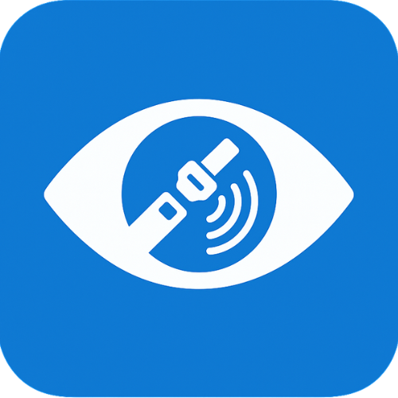

# BeltSense - AI-Powered Seatbelt Detection System



BeltSense is a comprehensive real-time seatbelt detection system that combines advanced computer vision, artificial intelligence, and mobile application development. The system features a custom-trained YOLOv8 classification model integrated with a Flutter mobile application for seamless, real-time seatbelt detection.

## 📊 Model Performance
- **Accuracy**: 95.7% (achieved at epoch 17)
- **Training Images**: 4,164 (1,870 seatbelt, 2,294 no-seatbelt)
- **Validation Images**: 916 (324 seatbelt, 592 no-seatbelt)
- **Total Dataset**: 5,080 images

## 🎯 Usage

### Train the Model
```bash
python run_training.py
```

### Real-time Webcam Detection 📹
```bash
python webcam_detector.py
```

### Test Random Images
```bash
python runModel.py
```

### Classify Static Images
```python
from seatbelt_classifier import classify_image, classify_folder

# Classify a single image
classify_image("path/to/your/image.jpg")

# Classify all images in a folder
classify_folder("path/to/your/folder")
```

## 📁 Project Structure
```
├── run_training.py          # Main training script
├── seatbelt_classifier.py   # Image classification functions
├── runModel.py              # Random image testing
├── webcam_detector.py       # 📹 Real-time webcam detection
├── test_webcam.py           # Webcam functionality test
├── seatbelt_dataset/        # Organized training data
├── seatbelt_model/          # Trained model outputs
│   └── final/weights/best.pt # Best trained model
└── requirements.txt         # Dependencies
```

## 🔧 Requirements
- Python 3.8+
- ultralytics (YOLOv8)
- opencv-python (for webcam)

Install dependencies:
```bash
pip install -r requirements.txt
```

## 🚀 Quick Start
1. **Train the model**: `python run_training.py`
2. **Test webcam**: `python test_webcam.py` (optional)
3. **Real-time detection**: `python webcam_detector.py`
4. **Test with random images**: `python runModel.py`

## 📹 Webcam Features
- Real-time seatbelt detection
- Live confidence scoring
- Mirror mode display
- Screenshot capture (press 's')
- Visual safety indicators
- Quit with 'q' key

The model will automatically detect seatbelts with high accuracy and provide confidence scores for each classification.
